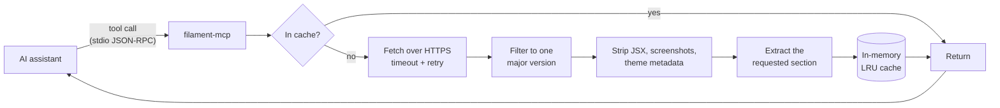

# filament-mcp

[](https://www.npmjs.com/package/filament-mcp)
[](https://github.com/ajaymahato431/filament-mcp/actions/workflows/ci.yml)
[](LICENSE)
[](https://nodejs.org)
[](https://modelcontextprotocol.io)

Ask an AI assistant to build a Filament v5 panel and it will often answer in v2
or v3 syntax — `->schema()` where v5 wants `->components()`, `->actions()` where
v5 wants `->recordActions()`, string icon names instead of the `Heroicon` enum.
The model is recalling old training data, and it has no way to check.

**filament-mcp** is a [Model Context Protocol](https://modelcontextprotocol.io)
server that gives the assistant a way to check. It fetches the real Filament
documentation on demand, strips it down to the part that was actually asked for,
and hands back only that. It runs locally, needs no API key, and writes nothing
to disk.

---

## Contents

- [How it works](#how-it-works)
- [Requirements](#requirements)
- [Installation](#installation)
- [Connect it to your editor](#connect-it-to-your-editor)
- [Tools](#tools)
- [Configuration](#configuration)
- [Usage examples](#usage-examples)
- [Troubleshooting](#troubleshooting)
- [Upgrading from 1.x](#upgrading-from-1x)
- [Contributing](#contributing)
- [License](#license)

---

## How it works

The server sits between your assistant and `filamentphp.com`, and its entire job
is to return the smallest useful answer.



Each stage exists to remove tokens the assistant does not need:

| Stage | What it removes |
| --- | --- |
| Version filter | Upstream ships one index covering Filament 1.x–5.x. Only your version survives. |
| Markdown cleanup | Mintlify JSX components, screenshots, code-fence theme metadata, HTML comments. |
| Section extraction | Everything except the heading you asked for. |
| LRU cache | The repeat request entirely. Successes and failures are both cached. |

Reading one section of `resources/overview` costs roughly a tenth of the tokens
of reading the whole page.

---

## Requirements

- **Node.js 20 or later** — check with `node --version`
- An MCP-capable client (Claude Code, Claude Desktop, Cursor, Cline, Windsurf,
  Antigravity, or anything else that speaks MCP)
- Outbound HTTPS access to `filamentphp.com`

No API key, account, or database is required.

---

## Installation

### Option A — npx (recommended)

Nothing to install. Point your MCP client at `npx` and it fetches the package on
first run. Jump straight to [Connect it to your editor](#connect-it-to-your-editor).

### Option B — global install

```bash
npm install -g filament-mcp
filament-mcp --version
```

### Option C — from source

<details>
<summary><strong>Linux and macOS</strong></summary>

```bash
git clone https://github.com/ajaymahato431/filament-mcp.git
cd filament-mcp
npm install
node index.js --version
```

</details>

<details>
<summary><strong>Windows (PowerShell)</strong></summary>

```powershell
git clone https://github.com/ajaymahato431/filament-mcp.git
cd filament-mcp
npm install
node index.js --version
```

</details>

The server speaks JSON-RPC over stdio. Running `node index.js` by hand will look
like it has hung — it is waiting for a client. Use `--help` to inspect it.

---

## Connect it to your editor

Add the server to your client's MCP configuration. The `npx` form below needs no
paths and works identically on every platform.

### Claude Code

```bash
claude mcp add filament-docs -- npx -y filament-mcp
```

### Claude Desktop

Edit `claude_desktop_config.json`:

- **macOS** — `~/Library/Application Support/Claude/claude_desktop_config.json`
- **Windows** — `%APPDATA%\Claude\claude_desktop_config.json`
- **Linux** — `~/.config/Claude/claude_desktop_config.json`

```json
{
  "mcpServers": {
    "filament-docs": {
      "command": "npx",
      "args": ["-y", "filament-mcp"]
    }
  }
}
```

### Cursor

Edit `.cursor/mcp.json` in your project, or `~/.cursor/mcp.json` globally, using
the same `mcpServers` block as above.

### Cline / Roo (VS Code)

Edit `cline_mcp_settings.json` via **MCP Servers → Configure**, using the same
block.

### Antigravity

Edit `~/.gemini/config/mcp_config.json` (on Windows,
`%USERPROFILE%\.gemini\config\mcp_config.json`), using the same block.

### Running from a local clone

If you installed from source, point the client at your checkout:

```json
{
  "mcpServers": {
    "filament-docs": {
      "command": "node",
      "args": ["/path/to/filament-mcp/index.js"]
    }
  }
}
```

Use the full path to your clone. On Windows either escape the backslashes
(`"C:\\path\\to\\filament-mcp\\index.js"`) or use forward slashes.

### Passing configuration

Every setting is optional. To override one, add an `env` block:

```json
{
  "mcpServers": {
    "filament-docs": {
      "command": "npx",
      "args": ["-y", "filament-mcp"],
      "env": {
        "FILAMENT_DOCS_VERSION": "4.x",
        "REQUEST_TIMEOUT_MS": "30000"
      }
    }
  }
}
```

Or pass flags, which take precedence over everything else:

```json
{
  "command": "npx",
  "args": ["-y", "filament-mcp", "--docs-version", "4.x"]
}
```

Restart your client after editing its configuration.

---

## Tools

Four tools are exposed. All are read-only.

| Tool | Purpose | Typical cost |
| --- | --- | --- |
| `list_filament_docs` | Browse the documentation index | ~130 tokens |
| `read_filament_docs` | Read one page, or one section of it | 200–4,000 tokens |
| `search_filament_docs` | Find pages by keyword | ~100 tokens |
| `filament_best_practices` | Curated v5 guidance and anti-patterns | ~200–900 tokens |

### `list_filament_docs`

| Argument | Type | Default | Description |
| --- | --- | --- | --- |
| `category` | string | — | Category to list. Omit for the summary. `"all"` lists every page. |
| `limit` | integer | all | Maximum pages to return. |
| `offset` | integer | `0` | Pages to skip, for paging. |

With no arguments it returns a map of the documentation rather than the
documentation itself:

```
# Filament 5.x documentation
161 pages across 17 categories.

  components — 27 pages
  forms — 23 pages
  tables — 23 pages
  resources — 13 pages
  ...
```

Categories are `components`, `forms`, `tables`, `resources`, `actions`,
`schemas`, `infolists`, `introduction`, `advanced`, `testing`, `plugins`,
`navigation`, `styling`, `notifications`, `users`, `widgets`, and `(top-level)`.

### `read_filament_docs`

| Argument | Type | Default | Description |
| --- | --- | --- | --- |
| `path` | string | **required** | Page path, e.g. `forms/select`. |
| `section` | string | — | Return only this heading's content. |
| `outline` | boolean | `false` | Return only the page's headings. |

`section` matching prefers an exact heading, then a prefix, then a substring —
asking for `Fields` will not return `Fields in forms`. If the section does not
exist, the response lists the headings that do, so the next call can be precise.

### `search_filament_docs`

| Argument | Type | Default | Description |
| --- | --- | --- | --- |
| `query` | string | **required** | Search terms. |
| `maxResults` | integer | `5` | Number of results (`SEARCH_MAX_RESULTS`). |
| `includeContent` | boolean | `false` | Also return the top result's full content. |

### `filament_best_practices`

| Argument | Type | Default | Description |
| --- | --- | --- | --- |
| `topic` | enum | — | One of `architecture`, `actions`, `database`, `forms`, `authorization`, `ui`, `antiPatterns`. Omit for all. |

Answers instantly, with no network access.

---

## Configuration

Precedence is **CLI flag → environment variable → built-in default**.

| Flag | Environment variable | Default | Description |
| --- | --- | --- | --- |
| `--docs-version` | `FILAMENT_DOCS_VERSION` | `5.x` | Filament major version to serve |
| `--timeout` | `REQUEST_TIMEOUT_MS` | `15000` | Per-request timeout (ms) |
| `--retries` | `REQUEST_RETRIES` | `2` | Retries for transient failures |
| `--cache-max` | `CACHE_MAX_ENTRIES` | `100` | Maximum cached documents |
| `--doc-ttl` | `DOC_TTL_MS` | `10800000` | Page cache lifetime (3 hours) |
| `--index-ttl` | `INDEX_TTL_MS` | `21600000` | Index cache lifetime (6 hours) |
| `--negative-ttl` | `NEGATIVE_TTL_MS` | `60000` | How long a failed fetch is remembered |
| `--max-results` | `SEARCH_MAX_RESULTS` | `5` | Default search result count |
| `--env-file` | — | — | Load a specific `.env` file |
| `--help` | — | — | Show help and exit |
| `--version` | — | — | Show the version and exit |

### Using a `.env` file

```bash
cp .env.example .env
```

Edit it and restart. A missing `.env` is not an error — every value has a
default. Variables already set in the environment (including your MCP client's
`env` block) always win over the file, so a stray `.env` cannot override your
client configuration.

`.env` is git-ignored. Only `.env.example`, which contains no secrets, is
committed. This server needs no credentials at all.

### Why there is no Dockerfile

This server is launched as a subprocess by your editor and talks over stdio; it
is not a long-running service. A container would add a process boundary and
startup cost without providing isolation your editor does not already have.
`npx` is the intended distribution.

---

## Usage examples

Once configured, use natural language — the assistant picks the tools.

**Discovering the right page**

> "Search the Filament docs for relation managers, then show me how to set one up."

**Reading a single section instead of a whole page**

> "Read the Authorization section of `resources/overview`."

**Checking syntax before writing code**

> "Before you write this resource, check the Filament best practices for
> anti-patterns, then show me the v5 syntax for table actions."

**Working against an older version**

Set `FILAMENT_DOCS_VERSION=4.x` for a project still on Filament 4, and the same
questions return v4 answers.

**Calling a tool directly** (from a client that supports it)

```json
{ "name": "read_filament_docs",
  "arguments": { "path": "forms/select", "section": "Searching" } }
```

---

## Troubleshooting

<details>
<summary><strong>The server does not appear in my client</strong></summary>

Restart the client after editing its configuration — most read it only at
startup. Then check `node --version` is 20 or later, and validate your JSON
(a trailing comma is the usual culprit).

Verify the server runs on its own:

```bash
npx -y filament-mcp --version
```

</details>

<details>
<summary><strong>"spawn npx ENOENT" on Windows</strong></summary>

Some clients cannot resolve `npx` from a bare name. Use the full path:

```powershell
(Get-Command npx).Source
```

Put that in `command`, or install globally with `npm install -g filament-mcp`
and use `filament-mcp` as the command.

</details>

<details>
<summary><strong>Requests time out</strong></summary>

Raise the timeout and retries:

```json
"env": { "REQUEST_TIMEOUT_MS": "45000", "REQUEST_RETRIES": "4" }
```

Behind a corporate proxy, set `HTTPS_PROXY` in the same `env` block. Node
respects it natively from version 20.

</details>

<details>
<summary><strong>The assistant is still writing old Filament syntax</strong></summary>

Confirm which version the server is serving — call `list_filament_docs` and check
the heading says `Filament 5.x`. If not, `FILAMENT_DOCS_VERSION` is set to
something else.

Then ask explicitly: *"Check the Filament docs before answering."* Some models
will answer from memory unless prompted to verify.

</details>

<details>
<summary><strong>I am seeing stale content</strong></summary>

Pages are cached in memory for three hours. Restart the server (or your client)
to clear the cache, or lower `DOC_TTL_MS`.

</details>

<details>
<summary><strong>A page returns 404</strong></summary>

The path is probably wrong, or belongs to a different version. Use
`search_filament_docs` to find the correct path rather than guessing. Failed
fetches are remembered for `NEGATIVE_TTL_MS` (one minute by default), so a
correction may take a moment to take effect.

</details>

<details>
<summary><strong>Responses are too large</strong></summary>

Use `section` to extract one heading, or `outline: true` first to see what the
headings are. Avoid `category: "all"` on `list_filament_docs`; prefer
`search_filament_docs`.

</details>

---

## Upgrading from 1.x

Version 2.0.0 fixes an index bug that could return documentation for the wrong
Filament version, so upgrading is recommended. Two behaviour changes may affect you:

- **`list_filament_docs` with no arguments** now returns a category summary
  instead of every page. For the old shape, pass `category: "all"` — which is
  also now correctly limited to a single version.
- **Node.js 20 or later** is required.

If your MCP configuration uses an absolute path to `index.js`, consider switching
to `npx -y filament-mcp`.

Full details are in the [changelog](CHANGELOG.md).

---

## Related servers

Built on the same core, for the rest of the stack:

- [django-mcp](https://github.com/ajaymahato431/django-mcp) — Django documentation
- [livewire-mcp](https://github.com/ajaymahato431/livewire-mcp) — Livewire documentation

---

## Contributing

Contributions are welcome — see [CONTRIBUTING.md](CONTRIBUTING.md). Please also
read the [Code of Conduct](CODE_OF_CONDUCT.md), and report security issues via
[SECURITY.md](SECURITY.md) rather than a public issue.

```bash
npm test                  # offline unit tests
npm run test:integration  # against the live documentation
```

## License

Released under the [MIT License](LICENSE). © 2026 Ajay Mahato.

Filament is a trademark of its respective owners. This project is not affiliated
with or endorsed by the Filament team; it only reads their public documentation.
